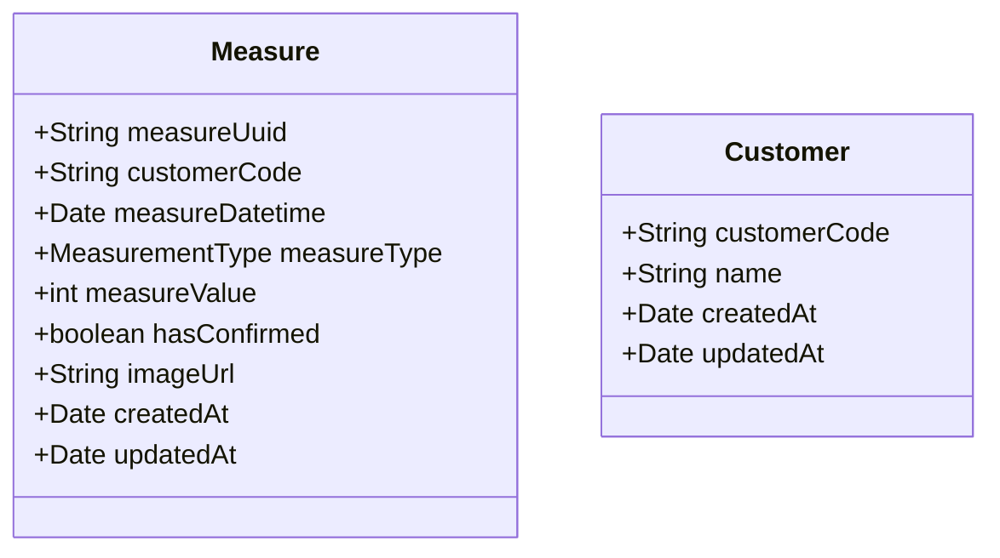

# Desafio proposto pela Shopper
Typescript RESTful API criada para o desafio.

# Executar no terminal:
    docker compose up

## Diagrama de Classes

```mermaid
classDiagram
    class Measure {
        +String measureUuid
        +String customerCode
        +Date measureDatetime
        +MeasurementType measureType
        +int measureValue
        +boolean hasConfirmed
        +String imageUrl
        +Date createdAt
        +Date updatedAt
    }

    class Customer {
        +String customerCode
        +String name
        +Date createdAt
        +Date updatedAt
    }

```

