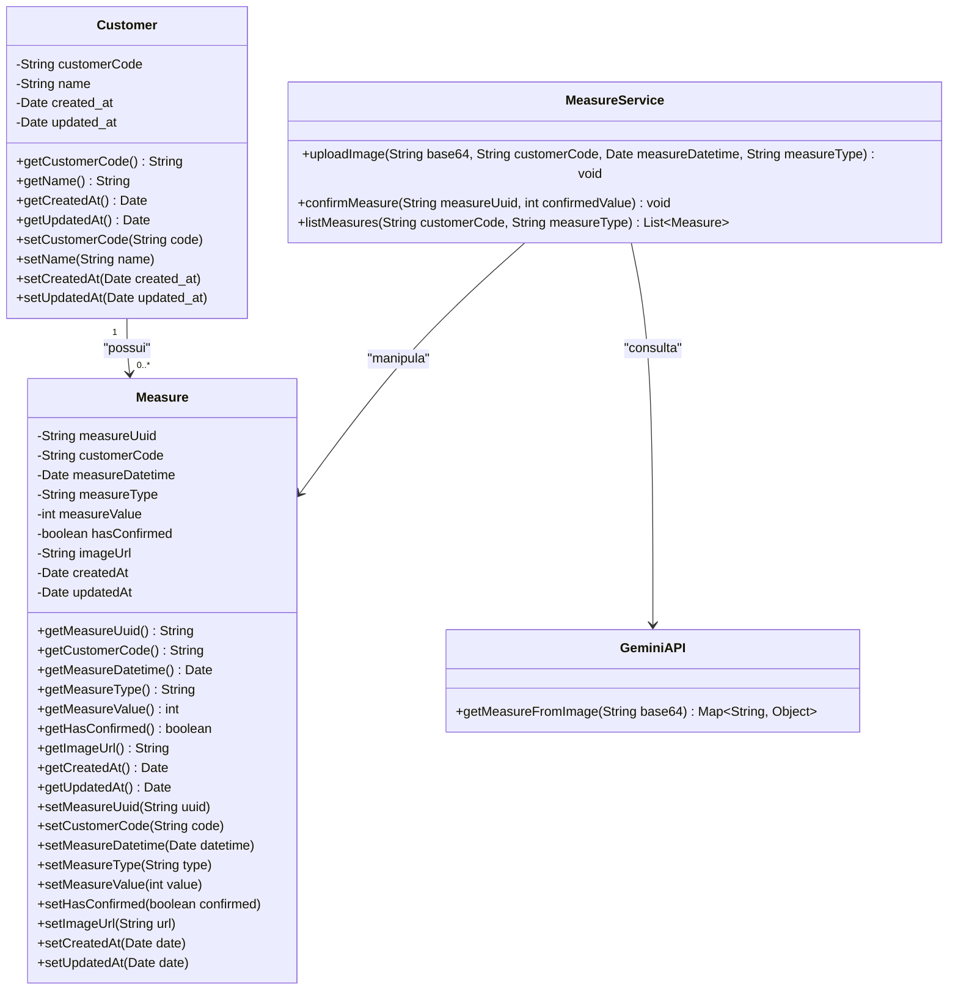

# Desafio proposto pela Shopper
Typescript RESTful API criada para o desafio.

## Diagrama de Classes

```mermaid
classDiagram
    class Customer {
        -String customerCode
        -String name
        -Date created_at
        -Date updated_at
        +getCustomerCode() String
        +getName() String
        +getCreatedAt() Date
        +getUpdatedAt() Date
        +setCustomerCode(String code)
        +setName(String name)
        +setCreatedAt(Date created_at)
        +setUpdatedAt(Date updated_at)
    }

    class Measure {
        -String measureUuid
        -String customerCode
        -Date measureDatetime
        -String measureType
        -int measureValue
        -boolean hasConfirmed
        -String imageUrl
        -Date createdAt
        -Date updatedAt
        +getMeasureUuid() String
        +getCustomerCode() String
        +getMeasureDatetime() Date
        +getMeasureType() String
        +getMeasureValue() int
        +getHasConfirmed() boolean
        +getImageUrl() String
        +getCreatedAt() Date
        +getUpdatedAt() Date
        +setMeasureUuid(String uuid)
        +setCustomerCode(String code)
        +setMeasureDatetime(Date datetime)
        +setMeasureType(String type)
        +setMeasureValue(int value)
        +setHasConfirmed(boolean confirmed)
        +setImageUrl(String url)
        +setCreatedAt(Date date)
        +setUpdatedAt(Date date)
    }

    class MeasureService {
        +uploadImage(String base64, String customerCode, Date measureDatetime, String measureType) void
        +confirmMeasure(String measureUuid, int confirmedValue) void
        +listMeasures(String customerCode, String measureType) List~Measure~
    }

    class GeminiAPI {
        +getMeasureFromImage(String base64) Map~String, Object~
    }

    Customer "1" --> "0..*" Measure : "possui"
    MeasureService --> Measure : "manipula"
    MeasureService --> GeminiAPI : "consulta"

```

